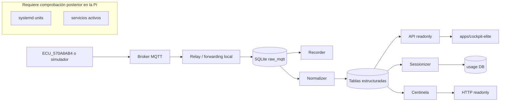

# NEXO V3-00 — Sistema autoritativo local

Estado: arquitectura local documentada a partir de archivos del repositorio. Lo que dependa de la Raspberry Pi queda como “requiere comprobación posterior”.

## Arquitectura lógica

El sistema local se organiza en capas:

1. Captura MQTT desde la ECU o un simulador.
2. Ingesta de crudos en SQLite.
3. Normalización hacia tablas estructuradas.
4. API readonly para consulta.
5. Sessionizer y Centinela como observadores de lectura.
6. Frontend oficial `apps/cockpit-elite` como consumidor de la API.

El prototipo histórico `prototypes/phase_f_dashboard` no es entrada de producto; conserva contratos, estilos y evidencia. `apps/dashboard-cinematic` permanece reservado.

## Arquitectura de ejecución

### Entradas localmente confirmadas

- `apps/recorder/nexo_recorder.py` y `deploy/systemd/nexo-ingest.service` encadenan la ingesta continua.
- `apps/core/nexo_normalizer.py` y `deploy/systemd/nexo-normalizer.service` materializan la normalización.
- `apps/api/nexo_api` expone la API local readonly.
- `apps/sessionizer/main.py` construye la vista de uso incremental.
- `apps/centinela/main.py` observa salud, estado y eventos.
- `apps/cockpit-elite/src/main.tsx` arranca el frontend oficial.

## Límite de confianza

### Confirmado por repositorio

- La ruta MQTT contractual usa `ecu/motoguarana/ECU_570A8AB4/...`.
- El bloque de seguridad usa `physical_outputs_enabled=false` y `remote_start_locked=true`.
- La base oficial se llama `nexo.sqlite3` y los módulos de almacenamiento están en `database/nexo_storage`.
- El frontend oficial del workspace es `apps/cockpit-elite`.

### Documentado pero no verificado en la Pi

- Qué unidades están realmente habilitadas y activas.
- Qué rutas HTTP están publicadas por la Pi.
- Si el frontend efectivo coincide con el binario/build que la Pi sirve.
- Si `nexo-api.service`, `nexo-cockpit.service` o `nexo-orbital-guardian-temp.service` existen en el host productivo.

## Flujo de datos

### Ingesta y persistencia

- `apps/recorder/nexo_recorder` valida mensajes MQTT y escribe la recepción cruda.
- `database/nexo_storage` y `apps/core/nexo_normalizer.py` separan ingreso crudo de materialización estructurada.
- `raw_mqtt` es el buffer de entrada; no debe borrarse en fases de auditoría.

### Consulta y visualización

- `apps/api/nexo_api` sirve datos de solo lectura.
- `apps/sessionizer` genera una base de uso separada.
- `apps/centinela` consulta y publica observación local sin escribir en la base productiva.
- `apps/cockpit-elite` consume la API y renderiza Portal/Cockpit/Dashboard.

## Contratos y dominios

| Dominio | Fuente local | Observación |
|---|---|---|
| Tópicos MQTT | `contracts/nexo_contracts/topics.py`, `config/mqtt_contract.yaml`, `contracts/README.md` | Prefijo contractual `ecu/motoguarana/ECU_570A8AB4/` |
| Payloads 41B | `contracts/fixtures/41b/*` | Fixtures válidos e inválidos para validación |
| Seguridad | `contracts/v1/mqtt.schema.json`, `database/SCHEMA_DESIGN.sql`, `apps/api/nexo_api/models.py` | Bloqueos `physical_outputs_enabled=false`, `remote_start_locked=true` |
| DB | `database/SCHEMA_DESIGN.sql`, `database/migrations/*` | SQLite única y lectura/escritura separadas por rol |
| Frontend API | `apps/cockpit-elite/src/api/*` | Mapas y contratos del cliente oficial |

## Propietarios funcionales

- Ingesta MQTT: `apps/recorder`.
- Normalización: `apps/core/nexo_normalizer.py` y `scripts/maintenance/nexo_056_mapper_41b.py`.
- API readonly: `apps/api/nexo_api`.
- Uso y sesión: `apps/sessionizer`.
- Observabilidad: `apps/centinela`.
- Interfaz: `apps/cockpit-elite`.

## Puntos de fallo

- Pérdida de MQTT o forwarding antes de `raw_mqtt`.
- Contención SQLite entre recorder, normalizador y consultas readonly.
- Divergencia entre documentación y servicios realmente cargados en la Pi.
- Reapertura accidental de automáticas físicas u odómetro.
- Desfase entre frontend oficial y prototipos históricos.

## Componentes protegidos

- `physical_outputs_enabled=false`.
- `remote_start_locked=true`.
- `release/nexo-10c-stable-banner-20260727-1325`.
- `release/nexo-11-integral-20260727-192006`.
- `prototypes/phase_f_dashboard` como evidencia histórica, no como input productivo.

## Interpretación del frontend

La evidencia local indica que:

- `apps/cockpit-elite` es el frontend oficial del workspace.
- `prototypes/phase_f_dashboard` es un prototipo histórico desacoplado.
- `apps/dashboard-cinematic` es un marcador reservado que todavía no aporta implementación.

La condición de despliegue real en la Pi queda fuera de la verificación local y debe marcarse como “requiere comprobación posterior”.
